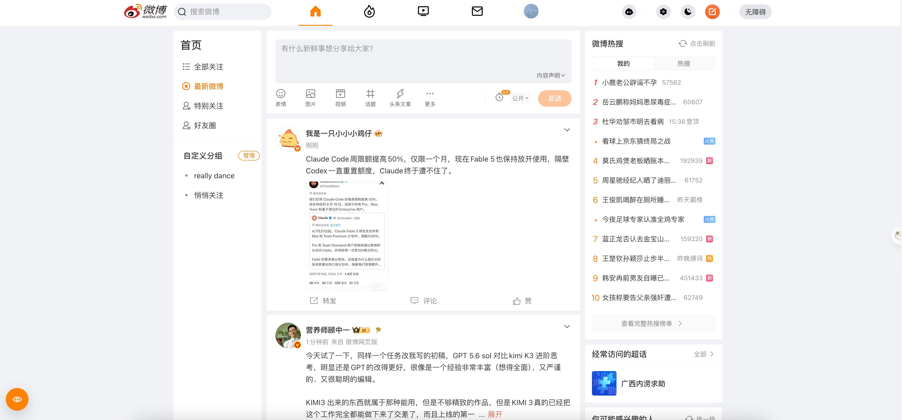
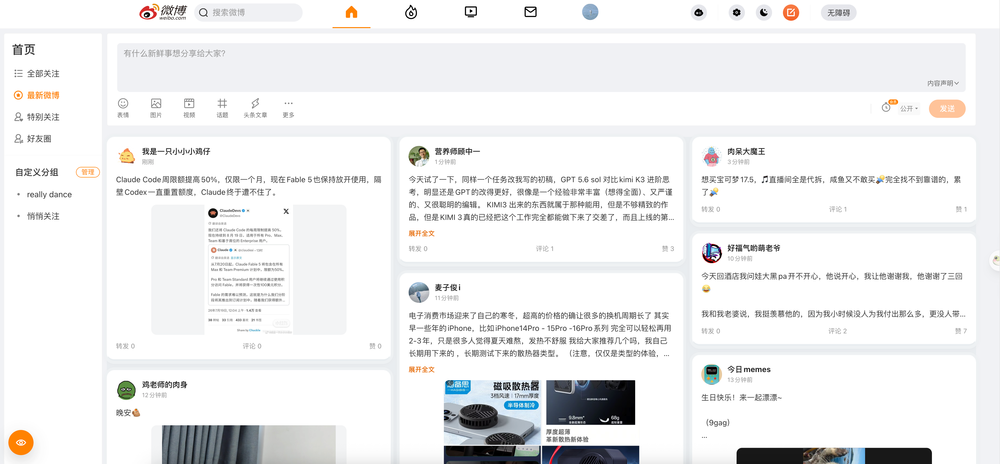

# rebo：把 weibo 变成更好读的 redbook

微博网页版在大屏上的利用率太低。中间是一条窄窄的单列，除了左边的分组有用，右边塞满热搜和推荐，其余都是空白。

rebo 是一个本地 Chrome / Edge 扩展。它不替你接管微博，只把页面排成更适合阅读的多列信息流，适合习惯在宽屏上慢慢刷微博的人。

## 前后对比

### 原版微博

### 开启 rebo 后的微博

## 用起来有什么不同

- **内容更多。** 信息流可在二、三、四列之间切换；图片、短文字和长内容不再都挤在同一条纵向队列里。

- **版型不变。** 顶部写微博，左侧的关注分组，多图、视频都照常使用

## 安装

1. 下载本仓库已发布的[最新压缩包](https://github.com/lemonsstyle/rebo/releases/)，并解压到 xxx 文件夹。
2. 谷歌浏览器地址栏输入 `chrome://extensions`（Edge 浏览器输入 `edge://extensions`）。
3. 打开右上角“开发者模式”（Edge 浏览器打开左下角“开发人员模式”）。
4. 选择“加载已解压的扩展程序”，（Edge 浏览器点击“加载解压缩的扩展”），点击 xxx 文件夹。
5. 刷新 `https://weibo.com/`，左下角出现橙色眼睛按钮，即可启动本扩展插件的功能。

## 处理范围

rebo 不保存 Cookie，也不会把个人信息上传到其他服务器，所有偏好都留存在本地，无隐私风险。

微博的网页结构和非公开接口可能会变化。遇到显示问题时可点击左下角按钮，暂时关闭“使用新布局”，回到官方单列信息流。我会及时更新插件保证舒适体验。

实现细节、接口取舍和维护检查见 [TECHNICAL_SUMMARY.md](TECHNICAL_SUMMARY.md)。
